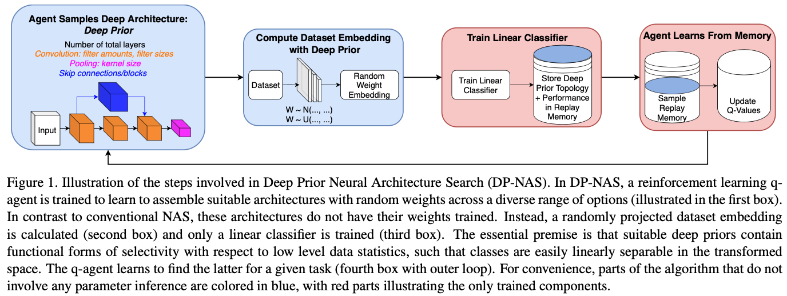
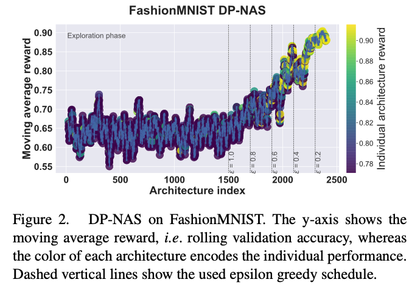

# Neural Architecture Search of Deep Priors (DP-NAS)
**Open-source code for our CVPR-W 21 paper "Neural Architecture Search of Deep Priors: Towards Continual Learning without Catastrophic Interference": IEEE open access version to release soon, preprint version [https://arxiv.org/abs/2104.06788](https://arxiv.org/abs/2104.06788)**

Please cite the paper if you make use of the content:

> **Martin Mundt°, Iuliia Pliushch°, Visvanathan Ramesh (° equal contribution).
> *Neural Architecture Search of Deep Priors: Towards Continual Learning without Catastrophic Interference.*
> IEEE Conference on Computer Vision and Pattern Recognition Workshops (CVPR-W) 2021, Continual Learning in Computer Vision Workshop (CLVision)**


## Preamble: DP-NAS repository content



The paper is roughly split into two parts: the first half focuses on neural architecture search of deep priors (random weight neural network architectures) and various experiments to gauge their utility, the second half shows how random embeddings created by those deep priors can be beneficial when employed for continual learning or even coupled with existing techniques. 

We have decided to **focus the code on the DP-NAS procedure** and reproduction of the **ablation experiments that empirically support our formulated key hypotheses**. 

Instead of providing yet another implementation of continual learning techniques on top, we have opted to **save the randomly transformed datasets**. That is, we use the deep prior NN architecture to process the initial dataset and simply save the output as a new dataset. This way, the user can **treat this saved version just like any other conventional dataset** to allow for use within their favorite software (and be computationally efficient without requiring constant re-computation of the deep prior). 

In summary, we provide code to empirically reproduce and examine the first three hypotheses of our paper:

* Hypothesis 1 - deep prior neural architecture search: A hierarchical neural network encoder with ran- dom weights acts as a deep prior. We conjecture that there exist deep priors, which we can discover through modern architecture search techniques, that lead to a classification task’s solution to the same degree of a fully trained architecture.
* Hypothesis 2 - deep priors and initialization lottery: A hierarchical neural network encoder with random weights acts as a deep prior, irrespectively of the precisely sampled weights. In particular, it is not subject to an initialization lottery.
* Hypothesis 3 - deep priors and parameter inference: A deep image prior performs at least equivalently, if not significantly better, when parameters are ad- ditionally inferred from the data population. However, we posit that the best deep priors are already close to the achievable performance.

Please see the section below on how to store embeddings (task 2 + store embeddings flag), and the very last section on hypothesis 4 (for continual learning experiments)

## DP-NAS code requirements
We have added the main code dependencies in a requirements text file. The code makes use of PyTorch and is a derived version of our previous MetaQNN architecture search code, which was open-sourced in the context of our CVPR-19 paper *"Meta-learning Convolutional Neural Architectures for Multi-target Concrete Defect Classification with the COncrete DEfect BRidge IMage Dataset"* [[paper](http://openaccess.thecvf.com/content_CVPR_2019/html/Mundt_Meta-Learning_Convolutional_Neural_Architectures_for_Multi-Target_Concrete_Defect_Classification_With_CVPR_2019_paper.html)] [[code](https://github.com/ccc-frankfurt/meta-learning-CODEBRIM)]

You can install them with ```pip3 install -r requirements.txt```. 
Note that most of the packages inside are not actually used, but we provide a full list of our machines packages for full reproducibility. 

Currently, this using a slightly older version of PyTorch: 1.3. 

We do not see any major issues in making use of our code in an updated PyTorch verison (e.g. we didn't see any immediate issues with 1.4.), but since we haven't tested newer versions thoroughly, we have listed 1.3 as a technical requirement. 

We will eventually update the repo to a newer PyTorch version. If you want to contribue, please feel free to also issue a pull request. 

## DP-NAS code structure

Apart from the main.py file, all the code is contained in the `lib` section of the repository. 
Folders for data will automatically be created and data downloaded upon execution of the code. 

* **Datasets**: Contains dataset loader classes, presently for MNIST, FashionMNIST and CIFAR. Can trivially be extended to other datasets by following the template. 
* **MetaQNN**: Contains the training logic behind the reinforcement based q-learning (q_learner.py), as well as the necessary utilities that define the states (functions), state transitions and their parsing from and to strings. 
* **Models**: Contains the network class, which parses through the list of states to assemble the actual neural network model and estimates their required occupied memory. Further files are a config for state space parameters (e.g. number of minimum, maximum convolutions and their size...) and a class for weight initialization
* **Training**: Contains the neural network training and validation/evaluation code. For convenience reasons, pre-processing of the dataset (i.e. calculating the random embedding + storing it for classifier training) is also included here (see next section for details). A class for potential learning rate scheduling is also provided. 
* **Utility**: Contains utility and visualization code. Primarily this is code to assess available GPU memory and the evaluation criterion (here, a simple accuracy). Further code to continuously visualize the architecture search (as in figure 2 of the paper), code to extract architectures from an already obtained search csv log file, and code to reproduce the remaining paper's figures is provided. 

In addition, there is a **command line parser** (cmdparser.py), which contains options for parameters and arguments on which part of the code to execute. Details on usage instructions are provided in the next section. 

## DP-NAS usage instructions

### Preamble: 
Before we get into the specific tasks (corresponding to hypotheses in our paper) that can be executed with our code, we note the following:

* The included datasets will automatically be downloaded
* Each new execution of the code will create a time-stamped folder in a 'runs' directory
* Each time-stamped experimental folder contains an stdout file. This file contains a list of all specified (and unset default) command line options for the specific experiment. 
* The time-stamped folder is also used to store temporal pre-preprocessed data sets (i.e. the calculated random embeddings). These get created and deleted automatically. Should you wish to save a deep priors random embeddings, e.g. for use in continual learning experiment with avalanche, please read below description under task 2. 

You can run our code with: 

`python3 main.py`

An additional flag `-t`, with a number of 1 or 2 will specify which portion of the code to run. See the next sections for a detailed description of the two available tasks. 

For a full set of command line options, you can call `python3 main.py --help`. Individual command line parameters and configurations are also explained in detail in below sections. 

### Task 1: DP-NAS: deep prior neural architecture search 
This is the actual deep prior neural architecture search procedure as described in the paper. 

It will conduct a search over a specified amount of architectures, whereas the sampled encoder architectures make use of entirely random weights/projections (no training). The only trained component is a linear classifier and the reinforcement based q-agent. The individual architectures' training parameters (such as mini-batch size, epochs etc.) are controlled through the command line parser. The more extensive search space is specified in a config file

#### Specifying the search space
The search space parameters are contained in `lib/Models/state_space_parameters.py`. 
We have made this sepration from the command line parser because it is easier to make specifications of long lists and sets this way. The following state space is default and can be modified in above file:

* `conv_sizes` - possible convolutional filter sizes: [1, 3, 5, 7, 9, 11]
* `conv_features` - possible number of convolutional features per layer: [16, 32, 64, 128, 256, 512, 1024]
* `conv_strides` - possible convolutional strides: [1]. *Note: we have enabled the stride of 2 by default for larger convolutions above 7,9,11*
* `pool_sizes`- possible size of pooling windows: [2, 3, 4]
* `pool_strides`- possible values for stride in pooling operations: [2, 3, 4]

The minimum and maximum amount of convolutional layers for an architecture (i.e. its minimum and maximum depth) can be specified in the command line parser: `-min-conv` and `-max-conv`. Their defaults are 3 and 12 respectively. 

There is two additional, purely empirically motivated configuration parameters, that serve the purpose to avoid completely meaningless architectures that just purely overfit:

* `max_image_size`: the maximum spatial resolution that should be used as input to the classifier. In other words, sampled architectures need to include at least enough down-sampling operations to down-size the input to this spatial dimension. The rationale is simply to avoid creation of architectures that retain the spatial dimensionality of the input, but increase the feature width to a factor of thousands. Those architectures would have absurd amounts of parameters that could simply learn identity transformations between layers or overfit completely. (default 8)  
* `max_num_fc_input`: Has the same motivation/use as the above parameter, but in a flattened representation of a single integer for the maximum vector size as input to the classification layer.  

In addition, the reinforcement replay buffer and employed epsilon greedy schedule can be specified here. 

* `epsilon_schedule` - a list of pairs, containing an epislon value and a number of epochs. The accumulated number of epochs of this list specifies the length of the entire architecture search. By default this is 1500 initial randomly sampled architectures (full exploration), followed by 100 architectures in steps of 0.1 epsilon for increased exploitation of the trained agent: [[1.0, 1500], [0.9, 100], [0.8, 100], [0.7, 100], [0.6, 100], [0.5, 100], [0.4, 100], [0.3, 100], [0.2, 100], [0.1, 100], [0.0, 3]]
* `replay_number` - number of samples drawn from the replay buffer to update Q-values: 50

#### Training hyper-parameters

Training hyper-parameters can be set through the command line parser (with defaults already set for the paper's experiments). 

This includes:

* `--epochs`: the number of epochs to train each individual architecture 
* `--learning-rate`: the Adam optimizer's learning rate. 
* `--batch-size`: the mini-batch size
* `--weight-decay`: An optional weight decay value (default 0)
* `--batch-norm`: A value for batch normalization. No batch normalization is used if set to 0.
* `--drop-out-prob`: A value greater than 0 creates a drop out layer before the classifier. We have not used this in our experiments, default 0.   

In addition to these SGD optimizer values (to train the linear classifier), there i two more parameters for the q-learner:

* `--q-learning-rate`: The learning rate of the q-learner. Typically something like 0.1
* `--q-discount-factor`: A q-learning discount factor. 

The q-learning hyper-parameters have been observed to work well in practice across a variety of scenarios. It is unlikely that you need to modify them.

#### Monitoring and logging
While the search is being run, each successive architecture will be appended to a csv file, which is stored in the automatically created results folder. A plot of the rolling average reward (as shown in paper figure 2) is also updated progressively. Note that this plot starts being generated after an initial 20 architectures have been explored (so that there actually exists a moving average)



There is also a separate `visualize_csv_results.py` file, which you can use to visualize a saved csv file. If you just execute it, it will generate a plot for our provided example csv file.  

##### Stored csv file 
This csv file has all essential information logged, such as: the final reward, the best validation accuracy, the validation accuracy for all epochs, the training accuracy for all epochs, the test accuracy (single value at the end), the epsilon value and finally the sampled network topology.

The network topology is encoded into a string, which is read and generated by our parser. 
This string specifies the sequence of layers: `C, P` or `SM`.

* `SM` denotes the final softmax layer with amount of classes. 
* `C` is a convolution, followed by number of features, conv size, stride, padding and a final value for skip connections. This last value has a 1 if is a straightfoward sequential layer, or a 0 if there is another (same size) convolution operation in parallel (a skip block) (perhaps counterintuitively, the existence of skip connections is thus indicated with a 0).
* `P` denotes a (max) pooling layer, followed by values for the pooling size and stride. 

#### Continue a search
Should you wish to stop and continue a started search later, you can make use of the command line options to continue the search.

You will need to set the boolean `--continue-search True`, use the `--q-values-csv-path` to point to the latest file with q-values, `--replay-buffer-csv-path` to point to the replay buffer and specify both `--continue-epsilon` and `--continue-ite` to continue. 

#### Automated computation batching to enable execution on lower GPU memory
As sampled architectures are quite deep, naively occupied GPU memory can be quite substantial.

However, note the following two points:

1. Our deep priors do not actually undergo training in their encoders, the mini-batch size is therefore only used to parallelize computation. 
2. Even when the full architecture is trained, the number of parallel computations is not tied to the stochastic gradient descent update. E.g. a 128 batch size can be calculated in chunks of 32, in 4 sequential computations, and activations/gradients accumulated before an update is applied. 

Because of the above two points, in our code, if the specified `--batch-size` is too large to fit into memory, we automatically asses what the maximum size for parallel computation is and split/sequentialize the computation internally. We automatically accumulate activations/gradients. 

##### Early stopping 
To save computation, we employ an early stopping criterion. That is, for architectures that have been sampled, but yield embeddings that make classifier optimization implausible, we move on to the next architecture sample early on (which can occur in the early exploration phase). 

Specifically, we can use the command line parameters to set an `--early-stopping-thresh` (e.g. to 0.15 for FashionMNIST so that an architecture needs to surpass the 10% random guessing) and an `--early-stopping-epoch`, the value at which the early stopping threshold is checked (e.g. 10 epochs for FashionMNIST). If the architecture doesn't surpass its random guessing accuracy after this period, it can be considered as impractical. *Note that this value should be adapted when moving on to problems with more or less classes*. 

### Task 2: Training individual or a set of best architectures from the search 
This task is used when a random deep prior, or an entire search is already available. 

We use this branch of the code for our experiments of hypotheses 2 and 3, with respect to training or evaluating an already existing deep prior topology (instead of conducting an entire search, as in task 1). 

There is three essential ways of how to use this branch. We provide an example csv (in the examples folder) with this repository and example execution instructions in the following.

#### 1. Use a search csv file without extra specification
You can specify a search csv file in addition to enabling task 2, i.e. use `-t 2 --replay-buffer-csv-path path/to/csv` (replace the path to csv with your path).

By default this will run the experiment of hypothesis 2, i.e. it will pick 6 low performing, 6 medium range and 6 top performing deep priors, resample the weights and train classifiers on top in order to gauge the variability when weights are re-sampled.

We have provided a FashionMNIST example csv file which you can use:

`python3 main.py -t 2 --replay-buffer-csv-path examples/replay_buffer_Fashion_example.csv`

#### 2. Use a search csv file with specification of index
You can just evaluate the use of an individual deep prior by pointing to a csv file and specifying the index of the architecture (i.e. the table row) to be loaded.

For instance, in our example csv file, you could use one of the final search indices (best architectures)

`python3 main.py -t 2 --replay-buffer-csv-path examples/replay_buffer_Fashion_example.csv --fixed-net-index-no 2621`

#### 3. Specify the raw network string
Instead of using stored csv files or selecting architectures from it, you can specify an architecture string (in the format explained above and as stored in csv) directly with the option `--net`.    

Alternatively to above two examples, you could create an architecture string yourself, or simply copy paste one from the csv file. In our example, the stored string of the architecture number 2621 could be used explicitly with:

`python3 main.py -t 2 --net '[C(32,5,1,2,1), P(4,4,0,0), C(32,3,1,1,0), C(1024,1,1,0,1), C(512,3,1,0,1), SM(10)]'`

Note that in our code, if an architecture string is given, it will always be chosen (even if a csv or index is specified as well).

#### Optional full training - conventional neural architecture search
For the verification of our hypothesis 3, we require networks to be fully trained.

For this purpose, we have included an additional command line parser option `--full-training`. 
Setting this to true, will also optimize the entire neural network encoder (instead of using a random weight deep prior). 

This option is primarily useful to reproduce the plots for hypotheses 2 and 3 of the paper in conjunction with above task 2.  

However, it technically also allows for a conventional NAS to be executed. 
If the user wishes to do this, we have left the additional option to search over classifiers in the command line parser and config files. 

First, the maximum number of fully connected layers `-max-fc` should be changed to an integer value > 0 (the default is 0, i.e. no MLP). 
The corresponding sizes for the search can then be specified in the config file. 

* Optional/Unused state space parameters:`fc_sizes` - possible number of units in fully-connected multi-layer classifier: {32, 64, 128}. *Note: this is not currently used because the number of fully connected layers is set to 0 in the command line parser. We left the code and option, should the user wish to run a conventional neural architecture search *

### Store random embeddings for further use in other software/continual learning Avalanche experiments (hypothesis 4)

To ease the computational burden during architecture search and testing, deterministic deep priors are used to pre-process the data into a random embedding (instead of calculating the same random embedding every time). During code execution, these random embeddings are stored in tmp folders of the experiment and later deleted once execution has finished. 

However, sometimes we would like to store the randomly projected dataset of a deep prior for further use, e.g. to conduct experiments in continual learning for hypothesis 4. 

As mentioned above in the readme, we have decided to not include continual learning code in this directory, as this would just be a giant copy paste of other repositories. 

Instead, we encourage the user to use our `--store-embedding True` option in conjunction with above described task 2. This way, a deep prior from a search can be loaded, the desired dataset randomly projected and this embedding subsequently stored on disc. 
You will then find the stored data in the corresponding experiment's directory (without it being deleted and treated as temporary files). 

##### Continual learning experiments
For investigation of the fourth hypothesis on using the obtained deep priors for continual learning, we recommend the PyTorch continual learning packaged called **Avalanche** [[paper](https://arxiv.org/abs/2104.00405)] [[website](https://avalanche.continualai.org)]. 

There, the transformed random embedding datasets obtained from the deep priors and DP-NAS from this repository can be coupled with various continual learning techniques (many more than the simple initial experiments we report in the paper) with a quite simple dataloader derived from basic PyTorch data utilities:

```
def npy_loader(path):
    sample = torch.from_numpy(np.load(path))
    return sample

# load the stored data
dataset_fixed_layer_outputs = torchvision.datasets.DatasetFolder(
    store_path, loader=npy_loader, extensions='.npy')

return torch.utils.data.DataLoader(
        dataset_fixed_layer_outputs,
        batch_size=dataloader.batch_size, shuffle=True,
        num_workers=dataloader.num_workers, pin_memory=torch.device('cuda') == device)
```


 